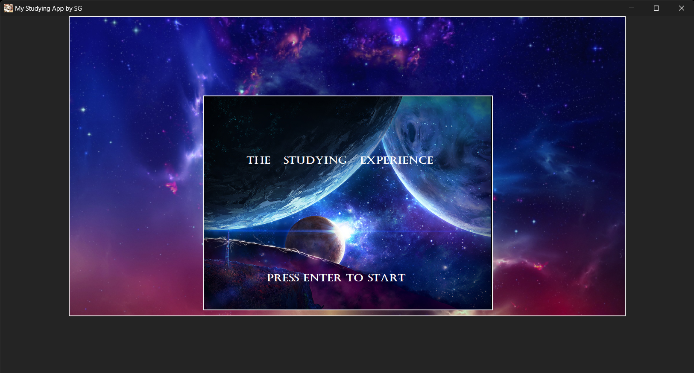
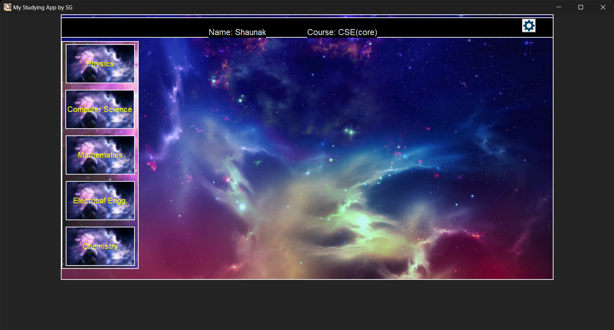
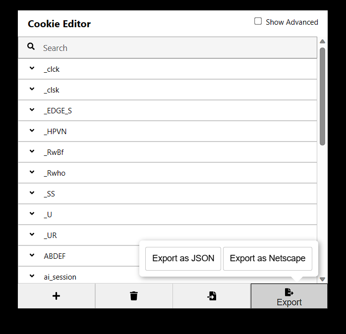

# 🧠 Studying App – Secure Note-Taking with Encryption, AI, and Voice Input

A modern desktop app to help students take, store, and manage study notes securely. Built with **Python**, **CustomTkinter**, **Fernet encryption**, and **speech recognition**, this app also integrates (optionally) with **ChatGPT** to help answer questions through a chatbot interface.

> 🏗️ Built as a school project in Class 12.  
> 💻 Fully functional and packaged for Windows (.exe).

---

## ✨ Features

- 📁 **Subject-based folders** to organize notes
- 🔐 **File-level encryption** using `cryptography` (Fernet) — files can't be opened externally
- 🧠 **Built-in chatbot (ChatGPT-powered)** *(note: module now deprecated, optional)*
- 🎙️ **Voice input for notes** using `speech_recognition`
- 🧰 **CustomTkinter GUI** with multi-window support (notes, subject creator, settings)
- 🧼 Lightweight and simple interface

---

📁 [Click here to view and download the app folder on Google Drive](https://drive.google.com/drive/folders/1DonUkmpYwsoGHB6LIxGTZIkCuIzuK5n8?usp=drive_link)

After opening:
1. Click the **Download icon** (top-right)
2. Google will zip the entire folder automatically
3. Extract the downloaded ZIP and run the `.exe`

📁 Make sure not to delete the folders created by the app (e.g., for subjects), as notes are saved and encrypted there.

---

## 🛠 Technologies Used

- `Python 3`
- `CustomTkinter`
- `cryptography` (Fernet)
- `speech_recognition`
- `pickle`
- `os`, `tkinter`, `PIL`
- (Previously: `revChatGPT`, now deprecated)

---

## ⚠️ Limitations

- The **ChatGPT bot integration** depends on an outdated module and may not function unless replaced with `openai` API.
- App is currently available **only for Windows** (via `.exe`)
- Not tested on Mac/Linux

---

## 📸 Screenshots

  
  

  
  

---

## 📄 How the Encryption Works

Each note you save is encrypted using **Fernet symmetric encryption**.  
Even if someone opens the `.dat` file externally, the contents are unreadable without the app.

This makes the app **safe for storing sensitive or personal academic notes.**

---

## 🧠 Future Improvements

- Replace deprecated AI module with OpenAI API (`openai.ChatCompletion`)
- Add dark mode and settings memory
- Export notes to PDF or .txt
- Version for Mac/Linux

---

## 🙋‍♂️ Author

Built by **Shaunak G** in Class 12  
🔗 [Visit Portfolio Site](https://shaunakg18.github.io/studying_app)

---

## 📜 License

This project is free for educational and personal use.

